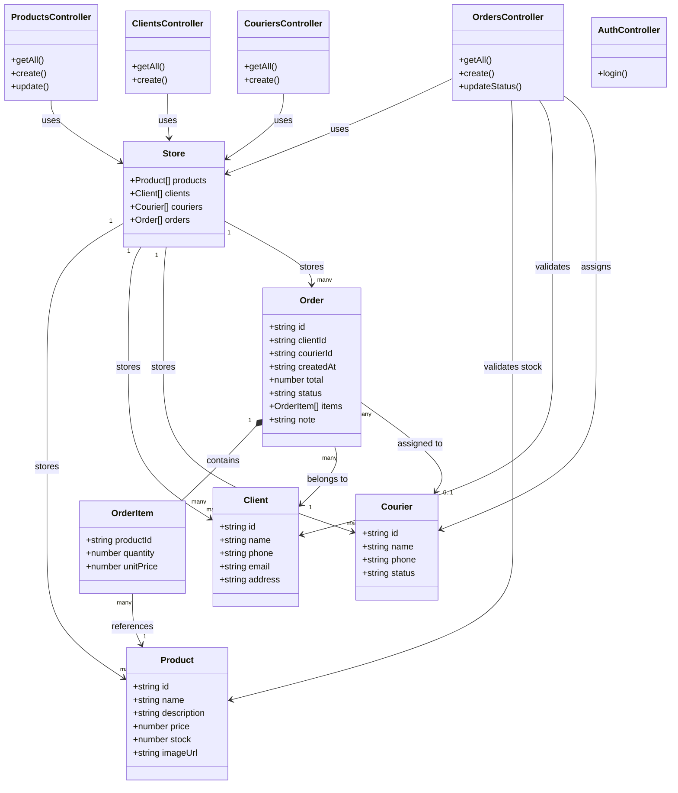
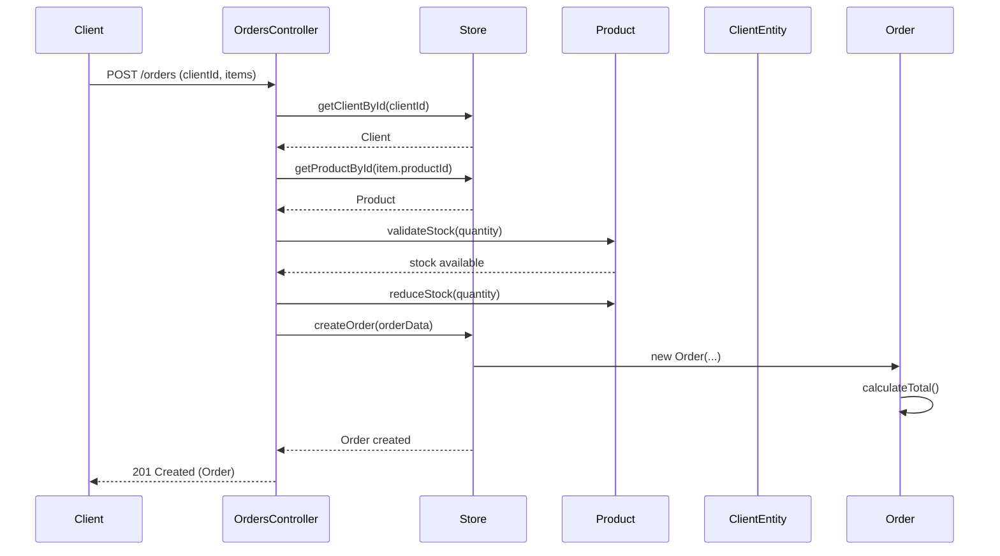

# DIAGRAMA DE CLASES
## Sistema de Gestión de Pedidos - D'CARMEN FLOWERS

### Diagrama en formato Mermaid

### Descripción de las Clases

#### 1. Product (Producto)
Representa los productos florales disponibles en la tienda.

**Atributos:**
- `id: string` - Identificador único generado con UUID
- `name: string` - Nombre del producto (requerido)
- `description?: string` - Descripción opcional del producto
- `price: number` - Precio unitario (requerido, mínimo 0)
- `stock: number` - Cantidad disponible en inventario (requerido, mínimo 0)
- `imageUrl?: string` - URL de la imagen del producto (opcional)

**Responsabilidades:**
- Almacenar información de productos florales
- Mantener control de inventario mediante el atributo stock

---

#### 2. Client (Cliente)
Representa los clientes de la floristería.

**Atributos:**
- `id: string` - Identificador único generado con UUID
- `name: string` - Nombre completo del cliente (requerido)
- `phone: string` - Teléfono de contacto (requerido)
- `email?: string` - Dirección de correo electrónico (opcional)
- `address?: string` - Dirección física del cliente (opcional)

**Responsabilidades:**
- Almacenar información de contacto de los clientes
- Proporcionar datos necesarios para la entrega de pedidos

---

#### 3. Courier (Repartidor)
Representa los repartidores del equipo de entrega.

**Atributos:**
- `id: string` - Identificador único generado con UUID
- `name: string` - Nombre completo del repartidor (requerido)
- `phone: string` - Teléfono de contacto (requerido)
- `status: string` - Estado del repartidor (requerido)
  - Valores posibles: `'available'`, `'busy'`, `'inactive'`

**Responsabilidades:**
- Representar miembros del equipo de entrega
- Gestionar disponibilidad para asignación de pedidos

---

#### 4. OrderItem (Item de Pedido)
Representa un producto específico dentro de un pedido.

**Atributos:**
- `productId: string` - Referencia al ID del producto (requerido)
- `quantity: number` - Cantidad solicitada del producto (requerido, mínimo 1)
- `unitPrice: number` - Precio unitario al momento de la compra (opcional, usa precio del producto si no se especifica)

**Responsabilidades:**
- Representar la relación entre un pedido y un producto
- Almacenar la cantidad y precio al momento de la compra
- Permitir cálculo del subtotal del item

**Relaciones:**
- Referencia a `Product` mediante `productId`

---

#### 5. Order (Pedido)
Representa un pedido completo realizado por un cliente.

**Atributos:**
- `id: string` - Identificador único generado con UUID
- `clientId: string` - Referencia al ID del cliente (requerido)
- `courierId?: string | null` - Referencia al ID del repartidor asignado (opcional)
- `createdAt: string` - Fecha y hora de creación en formato ISO (requerido)
- `total: number` - Total del pedido calculado automáticamente (requerido)
- `status: string` - Estado actual del pedido (requerido)
  - Valores posibles: `'pending'`, `'confirmed'`, `'preparing'`, `'out_for_delivery'`, `'delivered'`, `'cancelled'`
- `items: OrderItem[]` - Array de items del pedido (requerido, no vacío)
- `note?: string` - Nota adicional del pedido (opcional)

**Responsabilidades:**
- Agrupar múltiples productos en un pedido
- Calcular el total automáticamente
- Gestionar el estado del pedido durante el proceso de entrega
- Asociar cliente y repartidor

**Relaciones:**
- Contiene múltiples `OrderItem`
- Pertenece a un `Client` mediante `clientId`
- Puede tener asignado un `Courier` mediante `courierId`

**Métodos Implícitos:**
- Cálculo automático de `total` basado en items
- Validación de stock disponible antes de crear el pedido
- Actualización de stock de productos al crear el pedido

---

#### 6. Store (Almacén de Datos)
Representa el almacén de datos en memoria del sistema.

**Atributos:**
- `products: Product[]` - Array de productos disponibles
- `clients: Client[]` - Array de clientes registrados
- `couriers: Courier[]` - Array de repartidores del equipo
- `orders: Order[]` - Array de pedidos realizados

**Responsabilidades:**
- Centralizar el almacenamiento de todas las entidades
- Proporcionar acceso a los datos para los controladores
- Mantener la consistencia de los datos en memoria

**Nota:** En una implementación real, esta clase sería reemplazada por un sistema de base de datos.

---

#### 7. ProductsController (Controlador de Productos)
Maneja las operaciones relacionadas con productos.

**Métodos:**
- `getAll()` - Obtiene todos los productos
- `create()` - Crea un nuevo producto
- `update(id)` - Actualiza un producto existente

**Responsabilidades:**
- Gestionar las operaciones CRUD de productos
- Validar datos de entrada
- Interactuar con el Store

---

#### 8. ClientsController (Controlador de Clientes)
Maneja las operaciones relacionadas con clientes.

**Métodos:**
- `getAll()` - Obtiene todos los clientes
- `create()` - Crea un nuevo cliente

**Responsabilidades:**
- Gestionar el registro de clientes
- Validar datos de contacto
- Interactuar con el Store

---

#### 9. CouriersController (Controlador de Repartidores)
Maneja las operaciones relacionadas con repartidores.

**Métodos:**
- `getAll()` - Obtiene todos los repartidores
- `create()` - Crea un nuevo repartidor

**Responsabilidades:**
- Gestionar el registro de repartidores
- Mantener información del equipo de entrega
- Interactuar con el Store

---

#### 10. OrdersController (Controlador de Pedidos)
Maneja las operaciones relacionadas con pedidos.

**Métodos:**
- `getAll(status?)` - Obtiene todos los pedidos, opcionalmente filtrados por estado
- `create()` - Crea un nuevo pedido
- `updateStatus(id)` - Actualiza el estado de un pedido y opcionalmente asigna repartidor

**Responsabilidades:**
- Gestionar el ciclo de vida de los pedidos
- Validar disponibilidad de stock
- Calcular totales automáticamente
- Actualizar inventario al crear pedidos
- Gestionar estados y asignación de repartidores

**Validaciones:**
- Verificar que el cliente existe
- Verificar que los productos existen
- Verificar disponibilidad de stock
- Validar que el repartidor existe (si se asigna)

---

#### 11. AuthController (Controlador de Autenticación)
Maneja la autenticación de usuarios.

**Métodos:**
- `login(username)` - Autentica un usuario y genera un token

**Responsabilidades:**
- Gestionar el proceso de login
- Generar tokens de autenticación
- Validar credenciales

---

### Relaciones entre Clases

1. **Order → OrderItem:** Relación de composición (1 a muchos)
   - Un pedido contiene múltiples items
   - Los items no existen sin el pedido

2. **Order → Client:** Relación de asociación (muchos a uno)
   - Un pedido pertenece a un cliente
   - Un cliente puede tener múltiples pedidos

3. **Order → Courier:** Relación de asociación (muchos a uno, opcional)
   - Un pedido puede tener asignado un repartidor
   - Un repartidor puede tener múltiples pedidos asignados

4. **OrderItem → Product:** Relación de referencia (muchos a uno)
   - Un item referencia un producto
   - Un producto puede estar en múltiples items de diferentes pedidos

5. **Store → Entidades:** Relación de agregación (1 a muchos)
   - El Store contiene arrays de todas las entidades
   - Las entidades pueden existir independientemente del Store

6. **Controllers → Store:** Relación de dependencia
   - Los controladores utilizan el Store para acceder a los datos
   - Los controladores no almacenan datos directamente

---

### Diagrama de Secuencia (Ejemplo: Crear Pedido)

---

### Notas de Implementación

1. **Persistencia:** Actualmente los datos se almacenan en memoria. En producción, se recomienda usar una base de datos.

2. **Validaciones:** Las validaciones de negocio se realizan en los controladores antes de modificar el Store.

3. **IDs:** Todos los IDs se generan automáticamente usando UUID v4.

4. **Estados:** Los estados de Courier y Order se manejan mediante tipos enumerados para mayor seguridad de tipos.

5. **Cálculos:** El total del pedido se calcula automáticamente al crear el pedido, sumando el precio × cantidad de cada item.

---

**Versión del Diagrama:** 1.0.0  
**Última Actualización:** 2024

